# Chart JS Demo

> Sample Mendix app for the [Chart JS](https://github.com/bharathidas/ChartJS) widgets: bar (vertical and horizontal),
> line, area and pie charts on one page, with sample data and the microflows that feed them.

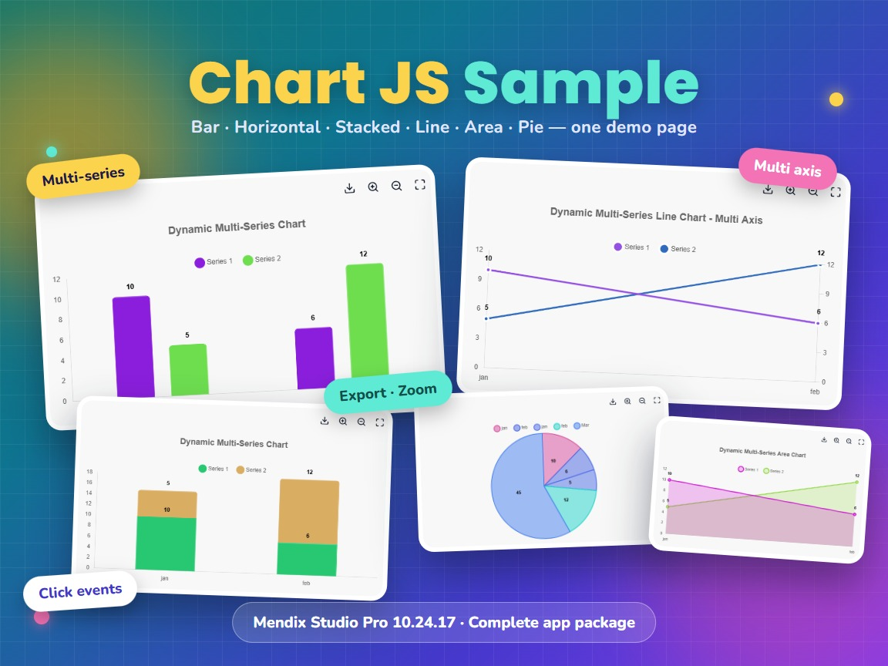

- Mendix Studio Pro 10.24.17 or newer, web only
- Includes all five Chart JS widget packages (Area, Bar, Line, Pie and ChartJSTwo)
- License: MIT

## Installation

This is a complete app package, not a module package.

1. Download `Chartjs2.mpk` from the [latest release](https://github.com/bharathidas/ChartJSDemo/releases).
2. In Studio Pro 10.24.17, choose **File > Import app package** and select `Chartjs2.mpk`.
3. Run the app and open the home page.

To use the widgets in your own app, import `ChartJSModule.mpk` from the
[Chart JS releases](https://github.com/bharathidas/ChartJS/releases) instead.

## What is inside

| Document | Purpose |
| --- | --- |
| Entity `Chart` | Label and data value for one point of a series |
| Entity `TestChart` | Options for the chart: stacked, horizontal, value on top, multiple axes, export and zoom buttons, clicked value |
| `DS_Chart` | Data source for the chart page |
| `ACT_Series1`, `ACT_Series2` | Build the two sample data series |
| `testOnClick` | Wired to the widget's On click action; the clicked value is stored in `OnClickValue` |
| Pages `Example`, `Chart_Overview`, `Chart_NewEdit` | The demo page and the pages for managing chart data |
| Building blocks `ChartJSBar`, `ChartJSLine`, `ChartJSArea`, `ChartJSPie` | Ready-made chart layouts you can drag onto a page |

## Documentation

- [Chart JS Sample 10.24.17.docx](docs/Chart%20JS%20Sample%2010.24.17.docx): install, a tour of the app, how the sample is built and how to adapt it.
- [Marketplace documentation](docs/Marketplace%20Documentation%20-%20Chart%20JS%20Sample.md): the same in short form.

## Screenshots

The screenshots are from the converted app running on the Mendix 10.24.17 runtime. The series colors change on
every page load, because the sample does not set a color attribute.

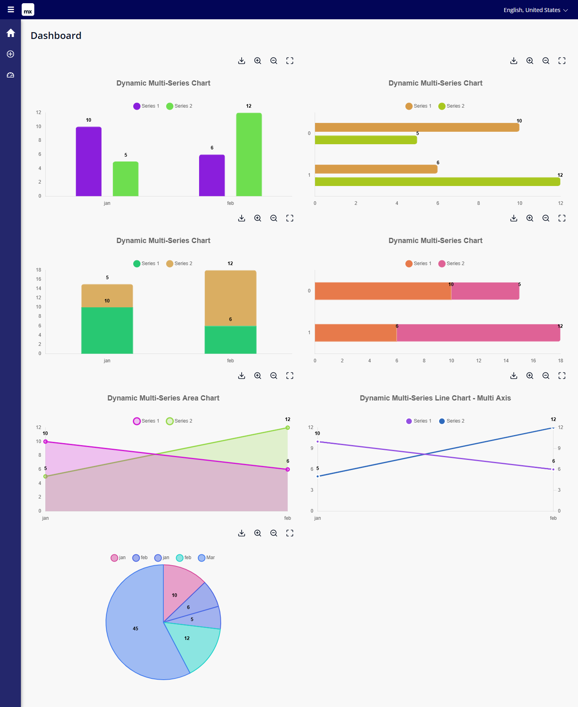

| | |
| --- | --- |
| 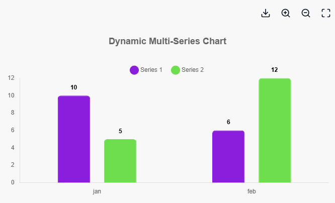 | 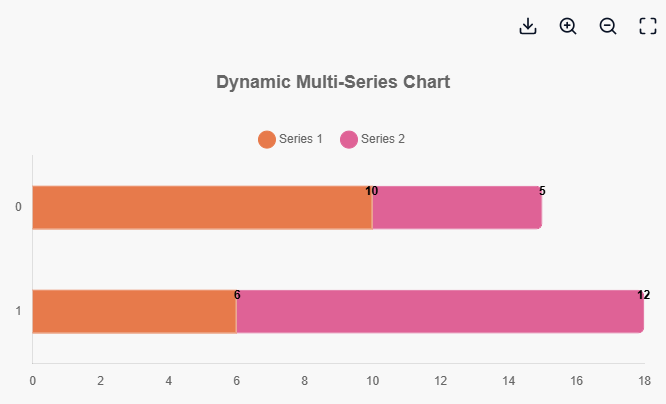 |
| 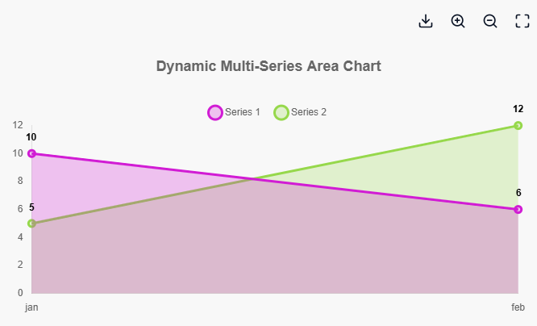 | 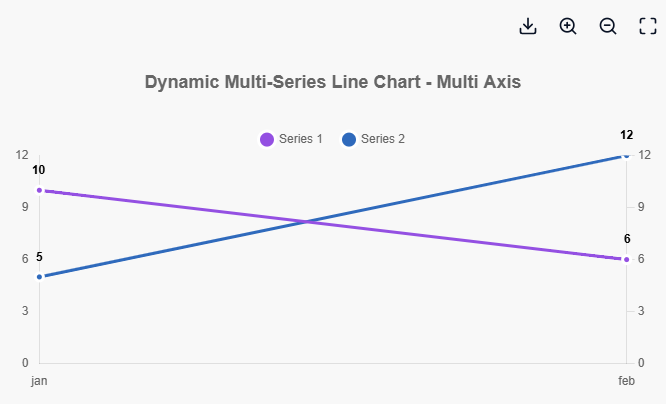 |
| 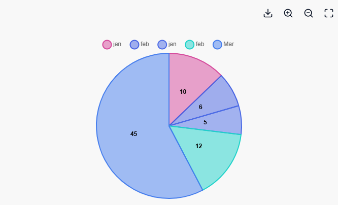 | 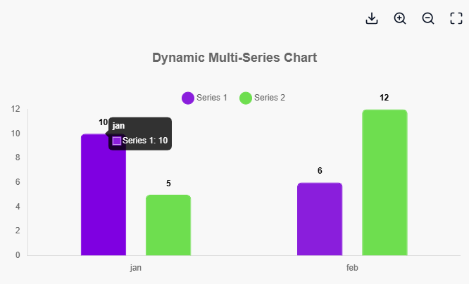 |
| 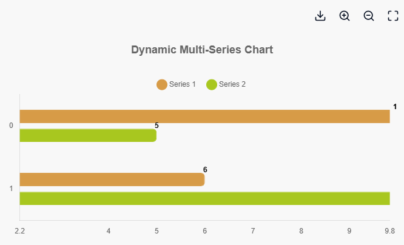 | 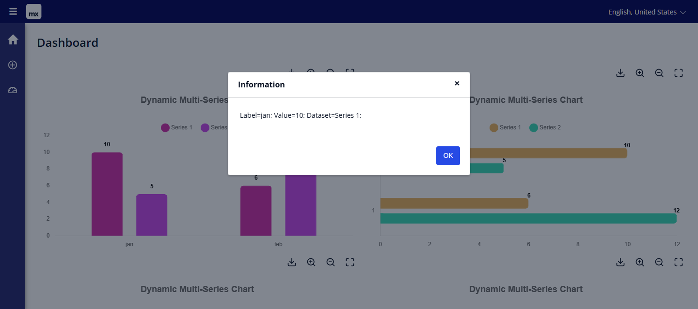 |
| 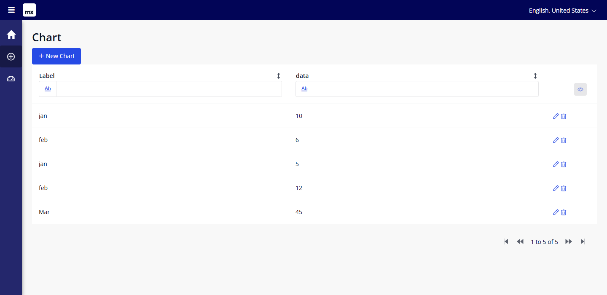 | 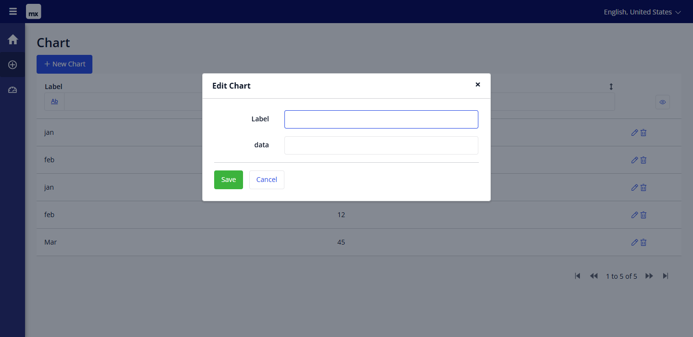 |

## Demo

https://chartjs2100-sandbox.mxapps.io/index.html?profile=Responsive

The demo runs on a free sandbox and may be asleep or stopped.

## Source

`releases/Chartjs2.mpk` was converted from Studio Pro 10.24.6 to 10.24.17. The functionality is unchanged.
The model check reports no errors. Its warnings come from Atlas templates, building blocks and menu items.
The converted app was started on the 10.24.17 runtime and checked in a browser: all seven charts are drawn,
tooltip, zoom and the click message work, and the browser console shows no errors.
Report issues in this repository.

## License

MIT, © 2026 Bharathidasan S.
